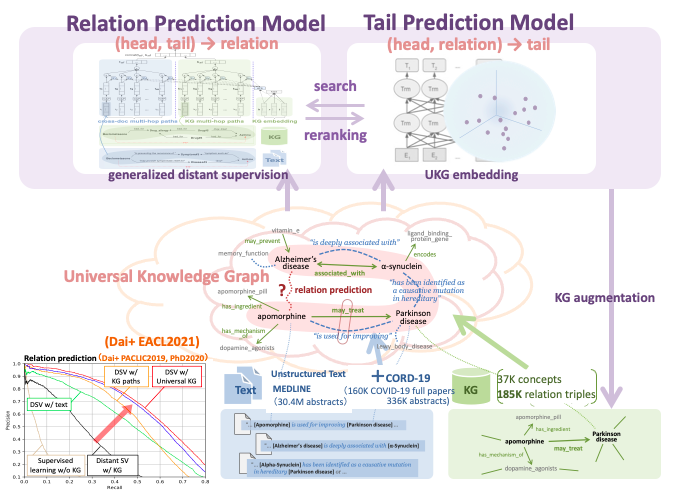

# Universal Knowledge Graph based Biomedical Knowledge Enlargment
## Introduction:
    
In order to support biomedical research on COVID-19 with information science, we are developing an AI system that automatically analyzes big data from 336K academic abstracts and 160 papers related to COVID-19 and other 30 million abstracts of biomedical papers. This system significantly augments the existing knowledge base by automatically extracting the vast amount of information and knowledge that may be relevant to COVID-19 from the big data. We also infer potential relationship among gene/protein, drug, disease , symptoms, enzyme, etc. based on the associations among the large mount of knowledge and reference relationships between papers. The system presents such information to researchers and supports access to academic papers, knowledge and a "big picture" that would contribute to the **academic** research on mechanism, drugs repurposing, diagnostics, etc.

## Extracted Biomedical Triples:

- The extracted biomedical triples as well as corresponding reasoning evidences are available [HERE](http://www.cl.ecei.tohoku.ac.jp/~dq/Data_for_M_CREST/KB_data/), where "predicted_triplets_with_evidences_1~3.json" contain COVID-19 related triples.
- The format of the dataset is as follows, where, 
    - "relation" is the predicted relationshop between "head" and "tail", 
    - "evidences" contain multiple multi-HOP reasoning paths, 
    - each path is annotated with its attention score "ATT",
    - each "HOP" represents a relationship between an entity pair (e.g., "COVID-19" and "D27_B_cells", 
    - each entity is marked by its UMLS UCI (e.g., "///C1824668"), 
    - HOPs are connected by an intermediate entity (e.g., "C1824668" is the intermediate entity connecting "HOP1" and "HOP2"),
    - "PMID" and "PCMID" are attached to each "HOP" for further checking.

~~~
[
    {
        "head": 'C0000000'
        "head_name": 'COVID-19'
        "tail": 'C0008269'
        "tail_name": 'chloroquine'
        "relation": 'may_be_treated_by'
        "score": 0.625663
        "evidences": [
                        {
                        "ATT": 0.2613531
                        "HOP1": 'moderate and Severe COVID-19///C0000000#ent patients have a higher number of CD21 D27_B_cells///C1824668#ent HDs .'
                        "PMID1": ''
                        "PCMID1": 'PMC7843151'
                        "HOP2":'CD27///C1824668#ent is a transmembrane disulfide-linked 55-kD homodimer present on most peripheral_blood_T_cells///C0005773#ent on a subset'
                        "PMID2": '8634448'
                        "PCMID2": ''
                        "HOP3": 'antihistamines and chloroquine///C0008269#ent with blood platelets polymorphonuclear leukocytes resulted in different alterations of regulatory functions these blood_cells///C0005773#ent'
                        "PMID3": '16842209'
                        "PCMID3": ''
                        },
                        {...}, ....
                     ]
     },
     {...}, ...

]
~~~
### An example:
Our system hypothesizes that "COVID-19 may_be_treated_by Chloroquine". The hypothesis is proposed based on multiple reasoning paths such as shown above. The hypothesis is recently shown to be promising by the [paper](https://www.kansensho.or.jp/uploads/files/topics/2019ncov/covid19_casereport_200519_2.pdf), which is published on [The Japanese Association for Infectious Diseases](http://www.kansensho.or.jp).

## Algorithm:

To identify biomedical concepts in textual corpus, we apply [Scispacy](https://allenai.github.io/scispacy/), a state-of-the-art biomedical named entity recognizer, to detect UMLS entities in text. 

To predict potentially related candidate concepts and generate the supporting explanation (Reasoning Path), we, firstly, represent the large amount of knowledge extracted from existing structured knowledge base and unstructured text as a **Universal Knowledge Graph**. In the **Universal Knowledge Graph**, each node represents the UMLS concept and each edge indicates a UMLS relationship or a textual relationship, as shown in Figure3. In addition, we will incorporate Multi-modal data such as molecular structure into the **Universal Knowledge Graph** in the future.

(Figure3)

Next, our system relies on a state-of-the-art Tail Prediction Model (Takahashi et al., 2018) that learns to project **Universal Knowledge Graph** into a same continuous vector space and predicts the candidate concepts based on the vector calculation. 

Then, our system searches the multi-hop reasoning paths that connect the candidate and target concept over the **Universal Knowledge Graph**. Finally, our system applies a new Relation Prediction Model (Dai et al., 2019, 2021) to classify (or reexamine) the relationship (a.k.a, relation classification) between target and candidate concepts based on the multi-hop reasoning paths and evaluate the contribution of each path via a Knowledge Graph based attention mechanism.

### Evalute the performance of the relation classification:
- Download the [Dataset](http://www.cl.ecei.tohoku.ac.jp/~dq/Data_for_M_CREST/RE_data/origin_data.zip) and unzip it in the main directory.
- Then, run the following commands for preprocessing, or you can download the preprocessed dataset from here: [part1](http://www.cl.ecei.tohoku.ac.jp/~dq/Data_for_M_CREST/RE_data/biomedical_part1.zip) and p[art2](http://www.cl.ecei.tohoku.ac.jp/~dq/Data_for_M_CREST/RE_data/biomedical_part2.zip), and unzip their contents under `biomedical_part1` and `biomedical_part2` directory respectively. 
~~~
python2 initialize_biomedical_part1.py
python2 initialize_biomedical_part2.py
~~~
- Download our pretrained model's [parameters](http://www.cl.ecei.tohoku.ac.jp/~dq/Data_for_M_CREST/RE_data/model.zip) and put them under `ugdsre_biomedical/model`, and test the model via following command.
~~~
cd ugdsre_biomedical
CUDA_VISIBLE_DEVICES=0 python test_baseline.py testing
~~~
- The Precison on the current testing data, which is a small subset of UMLS triples, is about **0.928**.

## Statistics:

| Corpus | Abstract | Paper | Textual Relation |
|---|---|---|---|
|CORD19| 336,029 | 160,656 | 2,087,918 |
|MEDLINE20| 30,420,660 | | 16,058,533 |

|Extracted New Triplets| in which COVID19 related|
|---|---|
|3,659,163|68,616|

## Members:
This project is led by [Kentaro Inui](http://www.cl.ecei.tohoku.ac.jp/~inui/) with a team of members: [Qin Dai](http://www.cl.ecei.tohoku.ac.jp/~dq/) and [Ryo Takahashi](https://reiyw.com/), from the Tohoku University, and is supported by the JST CREST Project on [Scientific Paper Analysis](https://www.jst.go.jp/kisoken/crest/en/project/44/15656596.html) (Research Director:[Yuji Matsumoto](https://cl.naist.jp/staff/matsu/home-e.html)). Special thanks to [Yoshimasa Tsuruoka](https://www.logos.ic.i.u-tokyo.ac.jp/~tsuruoka/) and [Akiko Aizawa](https://www.nii.ac.jp/en/faculty/digital_content/aizawa_akiko/) for their help and advice in building the system.

### References:
- Ryo Takahashi, Ran Tian and Kentaro Inui. 2018. Interpretable and Compositional Relation Learning by Joint Training with an Autoencoder. In *Proceedings of the 56th Annual Meeting of the Association for Computational Linguistics*(Volume 1: Long Papers), volume 1, pages 2148–2159.
- Qin Dai, Naoya Inoue, Paul Reisert, Ryo Takahashi and Kentaro Inui. 2019. Incorporating Chains of Reasoning over Knowledge Graph for Distantly Supervised Biomedical Knowledge Acquisition. In *Proceedings of the 33rd Pacific Asia Conference on Language, Information and Computation (PACLIC33)*, pages 19-28.
- Qin Dai, Naoya Inoue, Ryo Takahashi and Kentaro Inui. 2021. Two Training Strategies for Improving Relation Extraction over Universal Graph. In *Proceedings of the 16th Conference of the European Chapter of the Association for Computational Linguistics*, pages 3673–3684.

## Disclaimer:
The dataset is not for clinical usage! The dataset is ONLY for academic use, with no warranty or liability.
